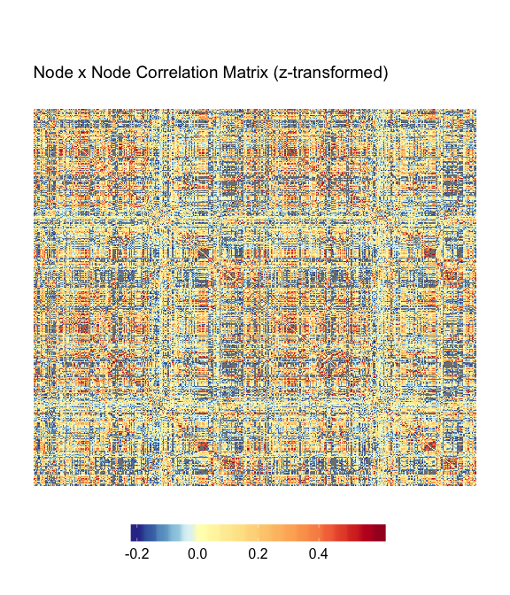
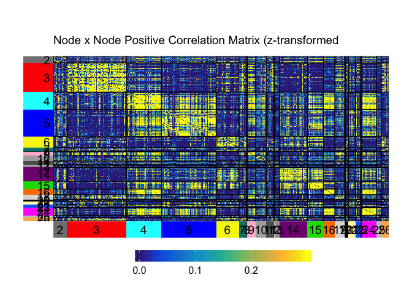

Gifti in R, Network Workflow
================
Micalea Chan
August 22, 2019

## Read in files

  - Gifti files here are mapped to fs\_LR 32k surfaces.
  - Node sets used can be downloaded from
    [github](https://github.com/mychan24/Chan_RSFC_Nodes)

<!-- end list -->

``` r
gL <- read_gifti(gL_file)
gR <- read_gifti(gR_file)

# nodes (L/R): Chan_RSFC_Nodes/gifti_multiple_columns/ROI_L/R_dis8_fwhm0_limit3_overlapEXCLUDE.func.gii
# metadata: Chan_RSFC_Nodes/Chan_RSFC_Nodes_PNAS2014_metadata.txt
node_L <- read_gifti(nodeL_file)    
node_R <- read_gifti(nodeR_file)    
node_order <- read.table(node_meta_table_file, sep="\t", header=T)  


# Load motion/tmask files
fd <- read.table(fd_file, col.names = "FD")
fd$vol <- 1:nrow(fd)

motion <- read.table(motion_file, col.names = c("X","Y","Z","P","Y","R"))
dv <- read.table(dv_file, col.names = "DVARS")
dv$vol <- 1:nrow(dv)

tmask <- read.table(tmask_file, col.names = "tmask")

# Tmask the motion files
fd <- data.frame(fd[as.logical(tmask$tmask),])
motion <- motion[as.logical(tmask$tmask),]
dv <- dv[as.logical(tmask$tmask),]

# Reasign volume #  after tmasking
fd$vol <- 1:nrow(fd)
dv$vol <- 1:nrow(dv)
motion$vol <- 1:nrow(motion)
```

## Extract Nodes’ mean time series from surface data

``` r
# sanity check
gL <- as.matrix(data.frame(gL$data))
gR <- as.matrix(data.frame(gR$data))
node_L <- as.matrix(data.frame(node_L$data))
node_R <- as.matrix(data.frame(node_R$data))

if(ncol(gL)!=ncol(gR)){
  stop("Column size (# volumes) of left & right hemisphere should be equal. Check input data.")
}

tp_L <- matrix(0, ncol(node_L), ncol(gL))
tp_R <- matrix(0, ncol(node_R), ncol(gR))

for(i in 1:ncol(node_L)){                 # Left Hemipshere
  tp_L[i,]<- colMeans(gL[node_L[,i]==1,])
}

for(i in 1:ncol(node_R)){                 # Right Hemipshere
  tp_R[i,]<- colMeans(gR[node_R[,i]==1,])
}

tp <- rbind(tp_L, tp_R)                   # combine L and R
rm(tp_L, tp_R) # cleanup
```

## Plot processed mean time series of each node

  - The heatmaps here are generated using a customized version of the
    [superheat (github)](https://github.com/mychan24/superheat) package.

<!-- end list -->

``` r
tp_to_longdat <- function(data){
  df <- data.frame(roi=1:nrow(data),data)
  names(df)[2:ncol(df)] <- 1:(ncol(df)-1)
  df_long <- gather(df, key = "vol", value = "bold", 2:(ncol(df)))
  df_long$vol <- as.numeric(df_long$vol)
  return(df_long)
}

motion_to_longdat <- function(data){
  tdf <- gather(motion, key = "XYZPYR", value="motion", 1:6) 
  tdf$XYZPYR<- factor(tdf$XYZPYR, c("X","Y","Z","P","Y.1","R"))
  tdf$vol <- as.numeric(tdf$vol)
  return(tdf)
}

df_long <- tp_to_longdat(tp)
mot_long <- motion_to_longdat(motion)

#### 1. Function for QC-metric plot  ####
fig_plot_qc <- function(vol, qc, qc_thres=NULL, qc_name="QC", qc_color="red", miny=NULL, maxy=NULL){
  df <- data.frame(vol=vol, qc=qc)
  
  if(is.null(miny) | is.null(maxy)){
    miny=min(df$qc)
    maxy=max(df$qc)
  }
  
  p <- ggplot(data = df, aes(x=vol, y=qc)) +
    geom_line(color=qc_color) +
    scale_x_continuous(expand = c(0, 0)) +
    scale_y_continuous(expand = c(0, 0), limits = c(miny,maxy)) +
    ylab(label = qc_name)
  
  if(!is.null(qc_thres)){
    qc_flag_x <- which(df$qc > qc_thres)
    qc_text <- sprintf("%s > %.2f = %d vol", qc_name, qc_thres, length(qc_flag_x))
    
    p <- p + geom_hline(yintercept = qc_thres, size=0.2, linetype="dashed") +
      annotate("text", -Inf, Inf, label=qc_text, hjust = 0, vjust = 1, color=qc_color)
  }
  p <- p + theme_minimal() +
    theme(axis.title.x=element_blank(),
          axis.text.x=element_blank(),
          axis.ticks.x=element_blank())
  return(p)
}

#### 2. Function for 6 motion plot  ####
fig_plot_motion <- function(data){
  ggplot(data, aes(x=vol, y=XYZPYR, fill=motion)) +
    geom_raster() +
    scale_fill_distiller(palette = "Greys") +
    scale_x_continuous(expand = c(0, 0)) +
    theme_minimal() +
    theme(legend.position = "none",
          axis.title.x=element_blank(),
          axis.text.x=element_blank(),
          axis.ticks.x=element_blank())
}

#### 3. Function for gray plot  ####
fig_plot_time_series <- function(data) {
  min <- -20 # min(data$bold)
  max <- 20 # max(data$bold)
  max_diff <- c(min, max) %>% abs() %>% max()
  ggplot(data, aes(vol, roi, fill = bold)) +
    geom_raster() +
    scale_fill_distiller(palette = "Greys", limits = c(-max_diff, max_diff),
                         guide = guide_colorbar(label = TRUE,
                                                frame.colour="black")) +
    scale_y_reverse(expand=c(0, 0)) + 
    scale_x_continuous(expand = c(0, 0)) +
    theme_minimal() + 
    theme(legend.position = "bottom",
          legend.margin=margin(c(-20,-300,0,5)))
}

g1 <- fig_plot_qc(vol = fd$vol, qc = fd$FD, qc_thres=0.3, qc_name="FD", miny = 0, maxy = 2)
g2 <- fig_plot_qc(vol = dv$vol, qc = dv$DVARS, qc_name="DVARS", qc_color = "blue")
g3 <- fig_plot_motion(mot_long)
g4 <- fig_plot_time_series(df_long)


plots_aligned <- AlignPlots(g1, g2, g3, g4)
```

    ## Warning: Removed 1 rows containing missing values (geom_path).

    ## Warning in .Primitive("max")(NULL, NULL, NULL, NULL): no non-missing
    ## arguments to max; returning -Inf

``` r
grid.arrange(as.grob(plots_aligned[[1]]), 
             as.grob(plots_aligned[[2]]), 
             as.grob(plots_aligned[[3]]), 
             as.grob(plots_aligned[[4]]), 
             ncol=1, heights=c(0.15,0.15,0.1,0.6))
```

<!-- -->

``` r
# tictoc::tic()
# g2 <- superheat::superheat(tp, y.axis.reverse = T,
#                      heat.lim = c(-20, 20),
#                      heat.pal = c("black","white"),
#                      grid.hline = FALSE,
#                      grid.vline = FALSE,
#                      title="Mean Time series of each node")
# tictoc::toc()
```

## Correlation Matrix (z-transformed)

``` r
r <- cor(t(tp))         # Correlation matrix between all nodes
z <- psych::fisherz(r)  # Fisher's z-transform: 0.5 * log((1+r)/(1-r))

diag(z) <- 0            # Set diagonal to '0'; not informative

superheat::superheat(z, 
                     y.axis.reverse = TRUE, # Used to make origin (0,0) on top left corner
                     heat.lim = c(-.2, .6), 
                     heat.pal = rev(brewer.rdylbu(100)), 
                     heat.pal.values = c(0, 0.15, 0.25, 0.75,1),
                     grid.hline = FALSE,
                     grid.vline = FALSE,
                     title="Node x Node Correlation Matrix (z-transformed)")
```

<!-- -->

## Correlation Matrix, nodes ordered by systems

### Setup System Color for Plot

``` r
# ==== Make Color label for heatmap
node_order$Color <- rgb(node_order$Power_red, node_order$Power_green, node_order$Power_blue)

plotlabel <- node_order %>%
  distinct(Power_label, Color) %>%
  arrange(Power_label)
```

``` r
superheat::superheat(X = z, 
                     y.axis.reverse = TRUE,
                     membership.rows = node_order$Power_label,
                     membership.cols = node_order$Power_label,
                     left.label.col=plotlabel$Color,
                     bottom.label.col=plotlabel$Color,
                     extreme.values.na = FALSE,
                     heat.lim = c(-.2, .6), 
                     heat.pal = rev(brewer.rdylbu(100)),
                     heat.pal.values = c(0, 0.15, 0.25, 0.75,1),
                     title="Node x Node Correlation Matrix (z-transformed")
```

<!-- -->

## Splitting Negative and Positive

``` r
# ==== Setup positive matrix plot
z_pos <- z
z_pos[z<0] <- 0
ss_pos <- superheat::superheat(X = z_pos, 
                     y.axis.reverse = TRUE,
                     membership.rows = node_order$Power_label,
                     membership.cols = node_order$Power_label,
                     left.label.col=plotlabel$Color,
                     bottom.label.col=plotlabel$Color,
                     extreme.values.na = FALSE,
                     heat.lim = c(0, .3), 
                     heat.pal = parula(20),
                     heat.pal.values = c(0, 0.5, 1),
                     title="Node x Node Positive Correlation Matrix (z-transformed")
```

``` r
# ==== Setup negative matrix plot
z_neg <- z
z_neg[z>0] <- 0
ss_neg <- superheat::superheat(X = z_neg, 
                     y.axis.reverse = TRUE,
                     membership.rows = node_order$Power_label,
                     membership.cols = node_order$Power_label,
                     left.label.col=plotlabel$Color,
                     bottom.label.col=plotlabel$Color,
                     extreme.values.na = FALSE,
                     heat.lim = c(-.3, 0), 
                     heat.pal = rev(parula(20)),
                     heat.pal.values = c(0, 0.5, 1),
                     title="Node x Node Negative Correlation Matrix (z-transformed")
```

``` r
gridExtra::grid.arrange(ggplotify::as.grob(ss_pos$plot), ggplotify::as.grob(ss_neg$plot), 
                        nrow=1)
```

<!-- -->
